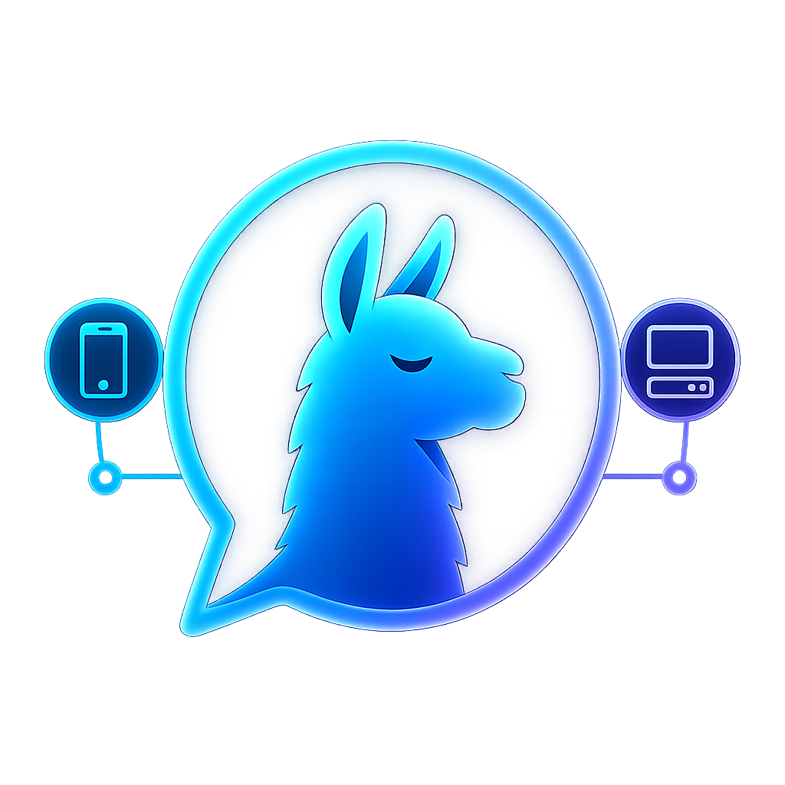

<p align="center">
  
</p>

<h1 align="center">BytePapo</h1>

<p align="center">
  Cliente Android em Flutter para conversar com um servidor Ollama na rede local.
</p>

---

## Visão Geral

BytePapo é um cliente mobile para uso local/LAN com servidores [Ollama](https://ollama.com/). O app permite cadastrar um servidor, selecionar um modelo, enviar mensagens via `/api/chat`, acompanhar respostas em streaming e manter um histórico local básico.

O projeto é voltado para Android e desenvolvimento local. Ele não inclui servidor próprio, autenticação, sincronização em nuvem ou distribuição publicada.

## Funcionalidades

| Área | Disponível |
| --- | --- |
| Servidor | Cadastro de servidor Ollama, normalização de host/porta e teste de conexão |
| Modelos | Listagem via `/api/tags` e seleção do modelo ativo |
| Chat | Envio via `/api/chat`, streaming em tempo real e cancelamento |
| Thinking | Suporte ao campo `thinking` quando retornado pelo modelo |
| Personagens | Nome, foto e instructions por personagem |
| Instructions | Políticas globais combinadas com instructions do personagem |
| Histórico | Conversas e mensagens salvas localmente |
| Markdown | Renderização de respostas em Markdown e cópia/exportação de conversa |

## Requisitos

- Flutter `3.44.4` ou superior.
- Dart `3.12.2` ou superior.
- Android SDK configurado.
- Dispositivo Android físico ou emulador.
- Servidor Ollama acessível pelo dispositivo na rede local.

Verifique o ambiente:

```powershell
flutter doctor
flutter devices
adb devices
```

## Instalação

Clone o repositório e instale as dependências:

```powershell
flutter pub get
```

Rode no dispositivo conectado:

```powershell
flutter run -d <device-id>
```

## Configuração do Ollama

O servidor Ollama precisa estar acessível pelo Android. Se o Ollama estiver rodando no computador e o app no celular, use o IP local da máquina, não `localhost`.

Exemplos aceitos pelo app:

```text
http://192.168.0.10:11434
192.168.0.10
```

Fluxo básico no app:

1. Abra a tela de servidor.
2. Cadastre o host/IP do Ollama.
3. Teste a conexão.
4. Liste os modelos.
5. Selecione um modelo.
6. Abra o chat.

## Comandos de Desenvolvimento

| Comando | Uso |
| --- | --- |
| `flutter pub get` | Instala dependências |
| `flutter analyze` | Executa análise estática |
| `flutter test` | Executa testes unitários e de widget |
| `flutter run -d <device-id>` | Roda no dispositivo selecionado |
| `flutter build apk --debug` | Gera APK debug |
| `flutter build apk --release` | Gera APK release |

## Documentação

- [Documentação técnica](./docs/TECHNICAL.md): arquitetura, fluxos internos, integração com Ollama, persistência local e decisões técnicas.
- [Política de segurança](./SECURITY.md): recomendações para uso em rede local e reporte de vulnerabilidades.
- [Privacidade](./PRIVACY.md): dados armazenados localmente e dados enviados ao servidor Ollama configurado.
- [Guia de contribuição](./CONTRIBUTING.md): fluxo de issues, pull requests e comandos de verificação.

## Builds Android

APK debug:

```powershell
flutter build apk --debug
```

APK release:

```powershell
flutter build apk --release
```

Arquivos gerados:

```text
build\app\outputs\flutter-apk\app-debug.apk
build\app\outputs\flutter-apk\app-release.apk
```

Instalar um APK manualmente:

```powershell
adb install -r build\app\outputs\flutter-apk\app-debug.apk
```

## Estrutura do Projeto

```text
lib/
  app/                  Configuração do app, tema e rotas
  core/
    errors/             Exceções e mensagens amigáveis
    network/            Cliente Ollama e parser de streaming
  features/
    chat/               Chat, histórico, personagens e contexto
    models/             Listagem e seleção de modelos
    servers/            Cadastro e teste de servidores
    settings/           Configurações globais e personagens
  shared/               Providers e widgets compartilhados
test/                   Testes unitários e de widget
android/                Projeto Android gerado pelo Flutter
docs/assets/            Imagens usadas pela documentação
```

## Persistência Local

O app usa `shared_preferences` para manter:

- servidores cadastrados;
- modelo selecionado;
- personagens;
- instructions globais;
- conversas e mensagens do histórico.

Essa abordagem é suficiente para histórico local básico. Para histórico grande, busca avançada ou sincronização, a persistência deve ser revista.

## Rede e Segurança

O Android está configurado para permitir HTTP sem TLS, o que facilita testes com Ollama em rede local.

Antes de usar fora de uma rede confiável, revise:

- exposição da porta `11434`;
- uso de HTTPS/TLS;
- autenticação ou proxy seguro;
- política de `cleartextTraffic` no Android.

Não exponha uma instância Ollama diretamente na internet sem uma camada de proteção.

## Limitações Conhecidas

- O app assume acesso direto ao servidor Ollama pela rede local.
- O histórico é local e básico.
- O indicador de carregamento do modelo é visual e aparece antes do primeiro chunk do streaming.
- A build release usa a configuração atual do projeto Android; revise assinatura e distribuição antes de publicar.

## Licença

Este projeto está licenciado sob a licença MIT. Consulte o arquivo [LICENSE](./LICENSE) para mais detalhes.
