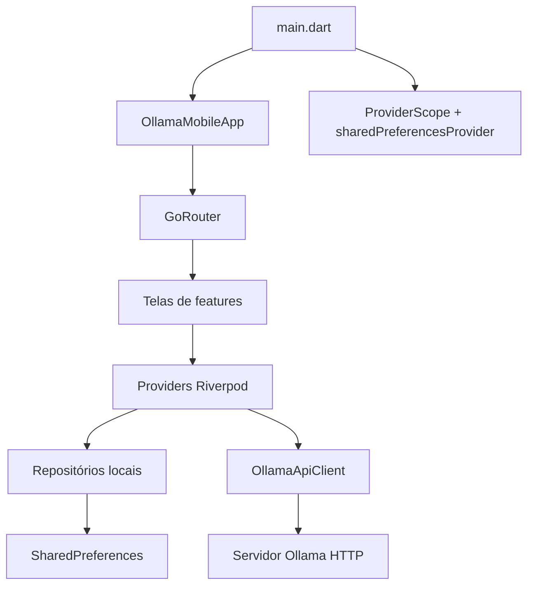
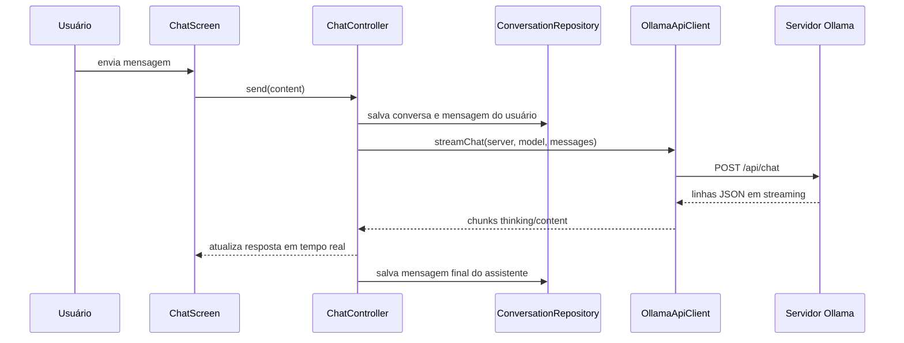

# Documentação Técnica do BytePapo

Este documento descreve a arquitetura, os fluxos principais e as decisões técnicas do BytePapo. Ele complementa o [README](../README.md), que permanece como entrada rápida para instalação e uso.

## Padrão de documentação

A estrutura segue práticas recomendadas para documentação em repositórios GitHub:

- manter o README como visão geral, guia de início e ponto de navegação;
- mover detalhes longos para arquivos em `docs/`;
- usar links relativos para facilitar leitura no GitHub e em clones locais;
- organizar informações técnicas em seções, tabelas e blocos de código com linguagem;
- usar diagramas Mermaid quando eles ajudam a explicar fluxos.

Referências oficiais:

- [About READMEs](https://docs.github.com/en/repositories/managing-your-repositorys-settings-and-features/customizing-your-repository/about-readmes)
- [Writing on GitHub](https://docs.github.com/en/get-started/writing-on-github)
- [Organizing information with tables](https://docs.github.com/en/get-started/writing-on-github/working-with-advanced-formatting/organizing-information-with-tables)
- [Creating diagrams](https://docs.github.com/en/get-started/writing-on-github/working-with-advanced-formatting/creating-diagrams)

## Visão técnica

O BytePapo é um cliente Android em Flutter para conversar com servidores Ollama acessíveis em rede local. O app não possui backend próprio: ele persiste dados no dispositivo e se comunica diretamente com a API HTTP do Ollama configurada pelo usuário.

| Camada | Responsabilidade | Caminhos principais |
| --- | --- | --- |
| App | inicialização, tema e rotas | `lib/main.dart`, `lib/app/` |
| Core | erros, cliente HTTP e parser de streaming | `lib/core/` |
| Features | telas, estado, entidades e repositórios por domínio | `lib/features/` |
| Shared | providers compartilhados do Riverpod | `lib/shared/` |
| Android | manifesto, permissões e configuração nativa | `android/app/` |
| Testes | testes unitários e de widget | `test/` |

## Arquitetura

O projeto usa uma organização por feature, com separação entre apresentação, domínio e dados quando a feature precisa de persistência ou contrato próprio.

```text
lib/
  app/                  App, tema e roteamento
  core/
    errors/             Falhas e exceções amigáveis
    network/            Cliente Ollama, endpoints e parser de streaming
  features/
    chat/               Conversas, mensagens, personagens e contexto
    models/             Listagem e seleção de modelos Ollama
    servers/            Cadastro, normalização e teste de servidores
    settings/           Configurações globais e personagens
  shared/               Providers Riverpod compartilhados
```

### Dependências arquiteturais



## Inicialização

A inicialização ocorre em `lib/main.dart`:

1. garante inicialização do Flutter com `WidgetsFlutterBinding.ensureInitialized()`;
2. inicializa dados de data/hora para `pt_BR`;
3. carrega `SharedPreferences`;
4. injeta `SharedPreferences` no `ProviderScope`;
5. inicia `OllamaMobileApp`.

O provider `sharedPreferencesProvider` lança `UnimplementedError` por padrão e precisa ser sobrescrito no `main`, o que deixa os repositórios testáveis por injeção de dependência.

## Roteamento

As rotas são declaradas em `lib/app/router.dart` com `go_router`.

| Rota | Tela | Uso |
| --- | --- | --- |
| `/servers` | `ServerScreen` | cadastro, seleção e teste de servidor |
| `/models` | `ModelsScreen` | listagem e seleção de modelo |
| `/chat` | `ChatScreen` | conversa ativa |
| `/chat?conversation=<id>` | `ChatScreen` | abertura de conversa existente |
| `/history` | `HistoryScreen` | histórico local |
| `/settings` | `SettingsScreen` | personagens e instructions globais |

A rota inicial é `/servers`, pois o app depende de um servidor Ollama acessível antes de listar modelos ou enviar mensagens.

## Estado e providers

O app usa Riverpod para compor repositórios, cliente HTTP e consultas assíncronas. Os providers principais estão em `lib/shared/providers.dart`.

| Provider | Tipo | Responsabilidade |
| --- | --- | --- |
| `sharedPreferencesProvider` | `Provider<SharedPreferences>` | acesso ao armazenamento local |
| `serverRepositoryProvider` | `Provider<ServerRepository>` | perfis de servidor |
| `modelSelectionRepositoryProvider` | `Provider<ModelSelectionRepository>` | modelo selecionado por servidor |
| `conversationRepositoryProvider` | `Provider<ConversationRepository>` | conversas e mensagens |
| `characterRepositoryProvider` | `Provider<CharacterRepository>` | personagens |
| `instructionsRepositoryProvider` | `Provider<InstructionsRepository>` | instructions globais |
| `ollamaApiClientProvider` | `Provider<OllamaApiClient>` | integração HTTP com Ollama |
| `activeServerProvider` | `FutureProvider<ServerProfile?>` | servidor ativo |
| `selectedModelProvider` | `FutureProvider<String?>` | modelo ativo do servidor |
| `modelsProvider` | `FutureProvider<List<OllamaModel>>` | modelos vindos de `/api/tags` |
| `conversationsProvider` | `FutureProvider<List<Conversation>>` | histórico de conversas |
| `charactersProvider` | `FutureProvider<List<ChatCharacter>>` | personagens cadastrados |
| `activeCharacterProvider` | `FutureProvider<ChatCharacter?>` | personagem ativo |
| `globalInstructionsProvider` | `FutureProvider<String?>` | instructions globais |

## Integração com Ollama

A integração HTTP fica em `lib/core/network/ollama_api_client.dart`.

| Operação | Endpoint | Método | Resultado |
| --- | --- | --- | --- |
| listar modelos | `/api/tags` | `GET` | lista de `OllamaModel` |
| enviar chat | `/api/chat` | `POST` | stream de chunks de resposta |

O envio de chat monta um payload com:

```json
{
  "model": "nome-do-modelo",
  "messages": [],
  "stream": true,
  "think": true,
  "options": {}
}
```

Os campos `think` e `options` só são enviados quando configurados. A resposta em streaming é processada por `OllamaStreamParser`, que lê linhas JSON, separa chunks de `thinking` e `content`, e encerra quando recebe `done: true`.

## Fluxo de chat

O fluxo principal é coordenado por `ChatController`.



Durante o envio, o controller:

- ignora mensagens vazias ou novo envio enquanto há streaming ativo;
- cria a conversa local se ainda não existir;
- combina instructions globais e instructions do personagem em um system prompt;
- preserva a mensagem do usuário em caso de erro;
- marca a resposta do assistente como `streaming`, `completed`, `failed` ou `cancelled`;
- permite cancelar a geração em andamento.

## Contexto e instructions

O contexto enviado ao Ollama é construído em `lib/features/chat/domain/chat_context_builder.dart`.

Quando existem instructions globais e de personagem, o system prompt é composto assim:

```text
[Politicas globais]
<instructions globais>

[Personagem]
<instructions do personagem>
```

Se houver system prompt, ele é inserido como primeira mensagem com role `system`. Em seguida entram as mensagens da conversa. Mensagens do assistente vazias são filtradas antes do envio para evitar contexto incompleto durante o streaming.

## Persistência local

A persistência usa `SharedPreferences` com listas de strings JSON. Essa escolha mantém o app simples e suficiente para histórico local básico, mas não é ideal para busca avançada, grandes volumes de conversa ou sincronização.

| Dados | Chave | Repositório |
| --- | --- | --- |
| servidores | `servers.profiles.v1` | `ServerRepositoryImpl` |
| servidor ativo | `servers.active_id.v1` | `ServerRepositoryImpl` |
| conversas | `chat.conversations.v1` | `ConversationRepositoryImpl` |
| mensagens | `chat.messages.v1` | `ConversationRepositoryImpl` |
| personagens | `chat.characters.v1` | `CharacterRepositoryImpl` |
| personagem ativo | `chat.active_character.v1` | `CharacterRepositoryImpl` |

As entidades são serializadas manualmente por `toJson` e reconstruídas por `fromJson`. Datas são persistidas em ISO 8601 UTC.

## Modelo de dados

### Servidor

`ServerProfile` representa um servidor Ollama configurado pelo usuário. Ele normaliza entradas como `192.168.0.10` para HTTP na porta `11434`, aceita `http` e `https`, valida portas entre `1` e `65535`, e suporta `basePath` opcional.

### Conversa

`Conversation` guarda metadados da conversa:

- id;
- título;
- servidor usado;
- modelo usado;
- personagem opcional;
- system prompt calculado;
- datas de criação e atualização;
- data de arquivamento opcional.

### Mensagem

`ChatMessage` guarda mensagens com role `system`, `user`, `assistant` ou `tool`. Cada mensagem possui status local, conteúdo principal, conteúdo de `thinking`, modelo opcional e timestamps.

Para envio ao Ollama, a mensagem é convertida para:

```json
{
  "role": "user",
  "content": "texto"
}
```

## Tratamento de erros

As falhas de rede e API são encapsuladas em exceções amigáveis em `lib/core/errors/app_exception.dart`.

| Origem | Tratamento |
| --- | --- |
| timeout | falha de tempo limite |
| `SocketException` | falha de rede |
| `HandshakeException` | possível bloqueio/erro de conexão |
| `http.ClientException` | falha HTTP genérica |
| status HTTP não 2xx | mensagem baseada no status |
| JSON inválido no streaming | `OllamaStreamParseException` |

No chat, erros preservam a mensagem do usuário, marcam a resposta do assistente como falha e exibem uma mensagem para tentativa posterior.

## Configuração Android

O manifesto principal está em `android/app/src/main/AndroidManifest.xml`.

Permissões:

- `android.permission.INTERNET`;
- `android.permission.ACCESS_NETWORK_STATE`.

Configuração relevante:

```xml
<application
    android:label="BytePapo"
    android:usesCleartextTraffic="true">
```

`usesCleartextTraffic="true"` permite HTTP sem TLS, necessário para muitos ambientes Ollama locais. Para distribuição pública, essa decisão deve ser revista junto com a política de segurança.

## Testes

Os testes ficam em `test/` e cobrem principalmente:

- parser de streaming Ollama;
- cliente da API Ollama;
- entidades e repositórios;
- composição de contexto de chat;
- controller de chat;
- widget inicial.

Comandos recomendados:

```powershell
flutter pub get
flutter analyze
flutter test
```

## Limitações técnicas atuais

- Persistência baseada em `SharedPreferences`, sem índice, paginação ou busca.
- Comunicação direta com Ollama, sem proxy, autenticação própria ou camada TLS gerenciada pelo app.
- Histórico local sem sincronização.
- A configuração Android permite cleartext traffic para facilitar uso em LAN.
- O projeto ainda não define pipeline de CI/CD no repositório.

## Evoluções recomendadas

- Migrar histórico grande para banco local, como SQLite/Drift.
- Adicionar CI com `flutter analyze` e `flutter test`.
- Documentar processo de release Android, assinatura e versionamento.
- Separar configuração de segurança para builds debug e release.
- Adicionar testes de integração para fluxos principais.
- Avaliar suporte a proxy HTTPS ou VPN documentada para acesso fora da LAN.
